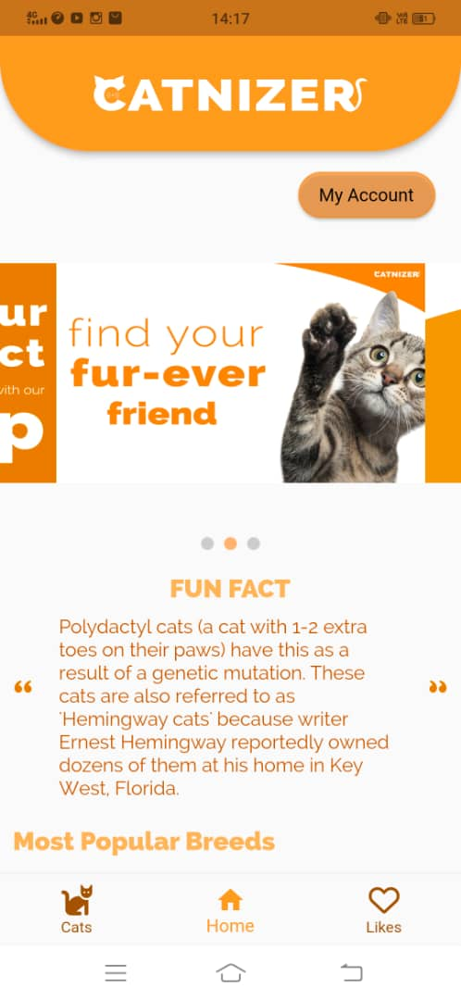
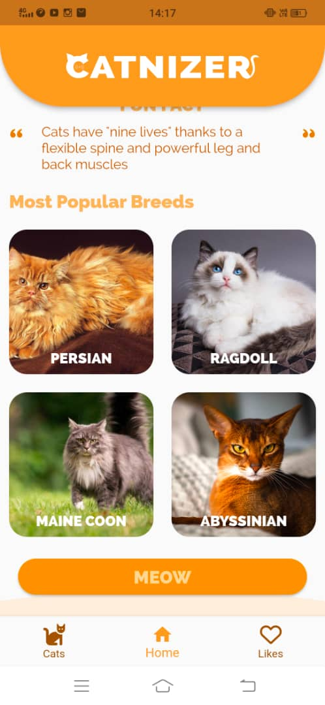
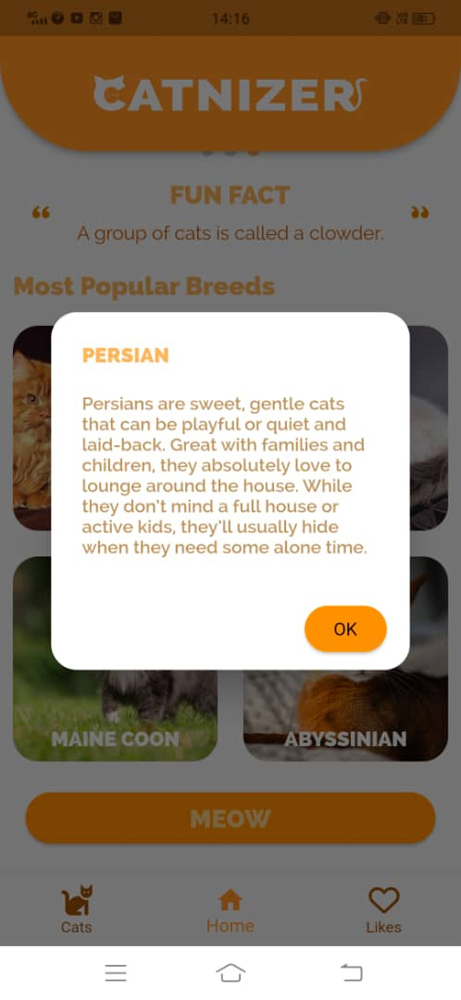
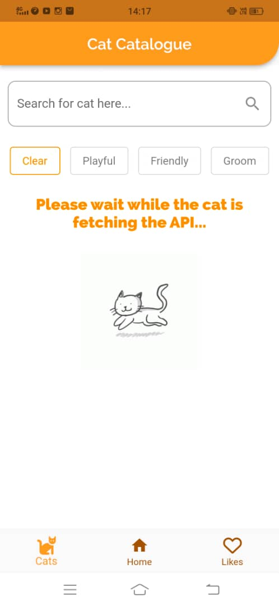
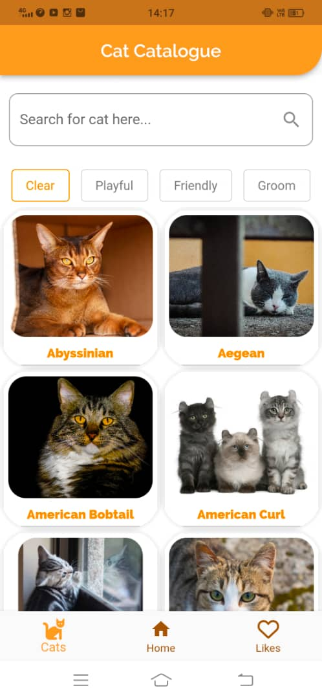
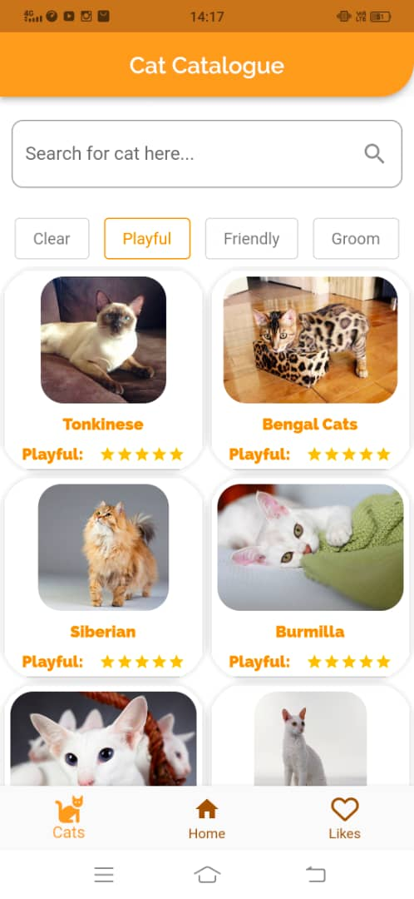
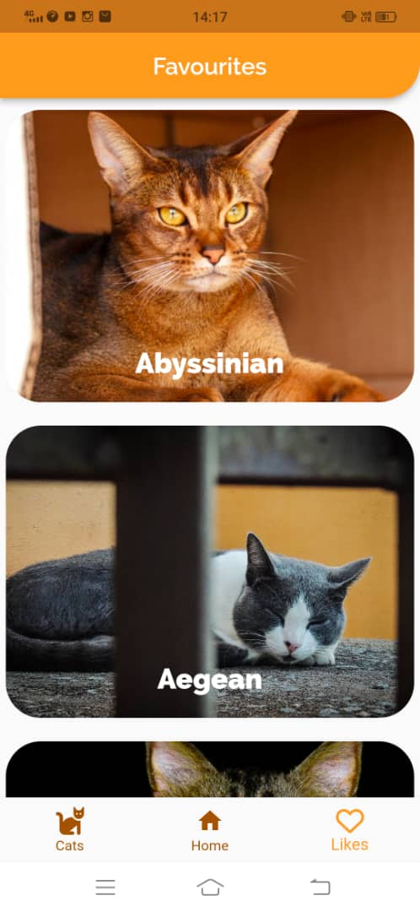
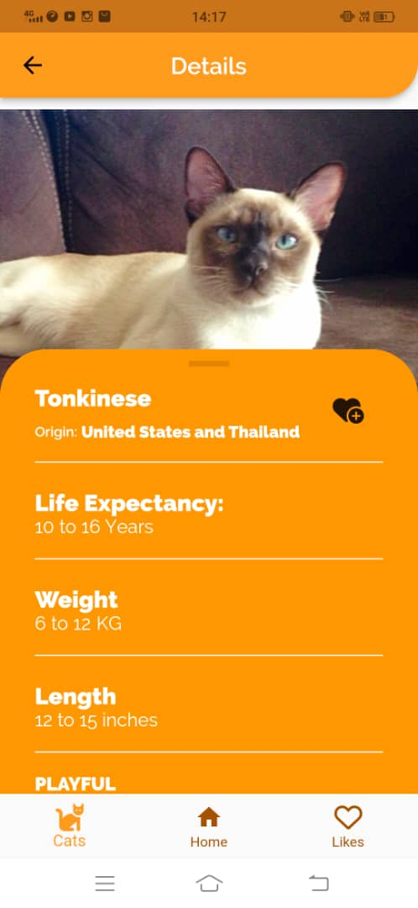
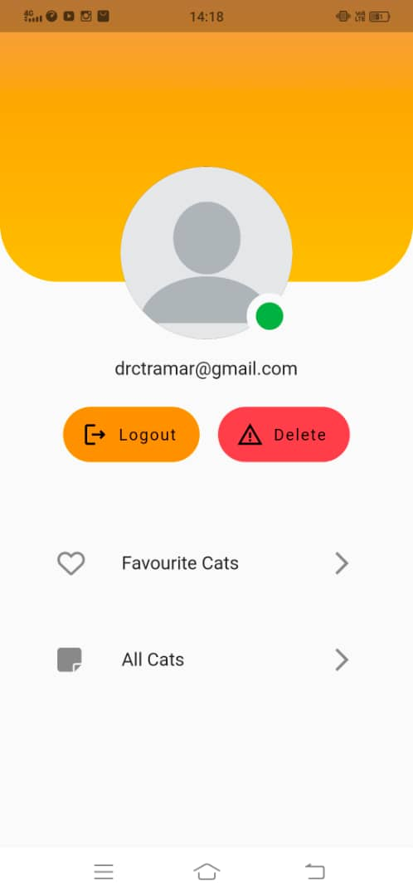

# catnizer

A new Flutter project.

## Getting Started

This project is a starting point for a Flutter application.

A few resources to get you started if this is your first Flutter project:

- [Lab: Write your first Flutter app](https://docs.flutter.dev/get-started/codelab)
- [Cookbook: Useful Flutter samples](https://docs.flutter.dev/cookbook)

For help getting started with Flutter development, view the
[online documentation](https://docs.flutter.dev/), which offers tutorials,
samples, guidance on mobile development, and a full API reference.

## Title: Catnizer 

### Description: This is a Flutter app designed and created for cat enthusiasts and people who are looking to learn more about cats and their many breeds. 

Features: 

- Allows you to search for any particular breeds and display the cat's details.
- Allows you to sort the list of cats based on their characteristics. (E.g: Playfulness, Friendliness, Etc.)
- Allows you to favorite a cat so you can see it later on your Favorite page.
- Provides a random cat facts every time you go to the Home page.

Platforms: iOS/Android. (Currently not responsive for desktop view)

1.Sign Up Page: 

2.Sign In Page: 

3.Main Page: 

4.Most Popular Breeds Section: 

5.Cat's Description: 

6.Cat Catalogue Fetching Details: 

7.Cat Catalogue Page: 

8.Cat Catalogue Sorting: 

9.Favourites Page: 

10.Cat Details Page: 

11.Account Page: 

Video Demonstration:

